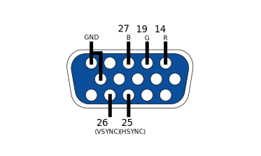

# IHM-Respirador

Projeto para uma interface Homem-Máquina desenvolvida a fim de ser utilizada para um respirador artíficial, voltado para um ESP32. Desenvolvido em nome da UTFPR-Câmpus Apucarana.

# Como utilizar

Faça download dos arquivos, e certifique-se de que tudo esta em uma pasta de mesmo nome do arquivo .ino (O Arduino IDE reclama caso contrário).

Compile o .ino para o ESP32 (Você precisa de arquivos adicionais para compilar pra esta placa, não está inclusa no pacote base do Arduino IDE).

*Arquivo .json indicado para o ESP32: https://dl.espressif.com/dl/package_esp32_index.json*

A imagem abaixo mostra quais pinos do ESP32 devem ser conectados no conector VGA.

Pronto! Na teoria o microcontrolador deve mostrar imagens no seu monitor VGA.

# Bugs conhecidos

-Nenhum ... No momento ...

# TODO

# Colaboradores

Bruno Gabriel da Silva

Lucas Zischler

