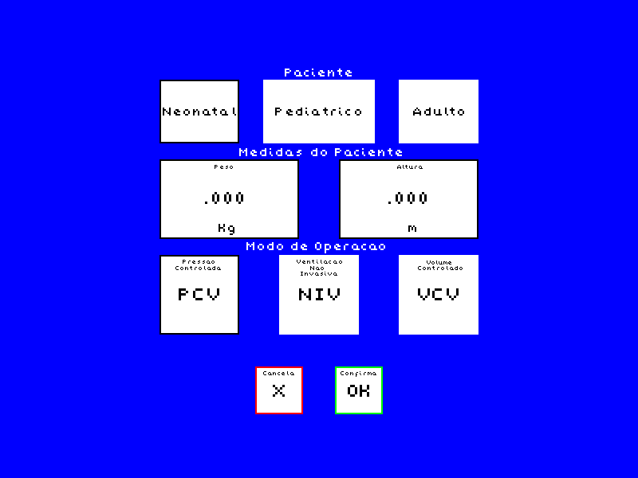
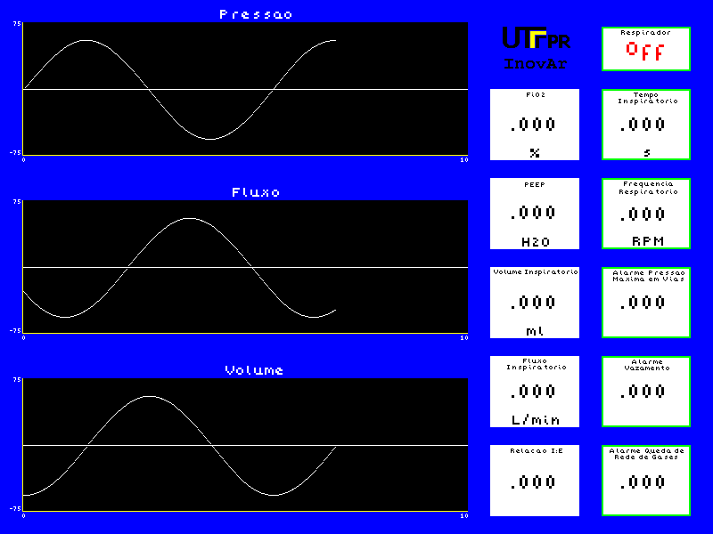
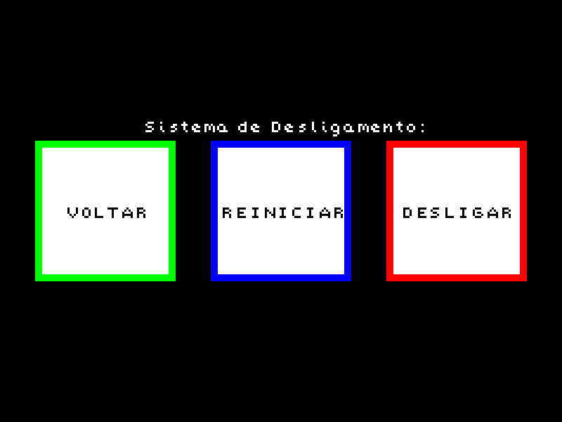

# Ventilador voltado para COVID-19

*READ IN OTHER LANGUAGE: [English](./README.en.md)*

Projeto de programação de um microcontrolador ESP32 desenvolvido a fim de ser utilizada para um ventilador pulmonar, voltado auxiliar no combate a COVID-19. Desenvolvido em nome da UTFPR-Câmpus Apucarana.

# Como utilizar

Faça download dos arquivos, e certifique-se de que tudo esta em uma pasta de mesmo nome do arquivo .ino (O Arduino IDE reclama caso contrário).

Compile o .ino para o ESP32 (Você precisa de arquivos adicionais para compilar pra esta placa, não está inclusa no pacote base do Arduino IDE).

*Arquivo .json indicado para o ESP32: https://dl.espressif.com/dl/package_esp32_index.json*

A imagem abaixo mostra quais pinos do ESP32 devem ser conectados no conector VGA.

Pronto! Na teoria o microcontrolador deve mostrar imagens no seu monitor VGA.

# Resultados

Algumas das telas geradas no monitor pelo programa:

## Tela de parâmetros iniciais

Configurações iniciais do sistema são inseridas nesta tela.

## Tela de durante operação

Esta tela é a fase principal de operação, mostrando os gráficos necessários e dados numéricos, na coluna à esquerda. A coluna à direita define parâmetros passiveis de mudança durante operação.

## Tela de desligamento/reinicialização

Permite desligar/reinicializar o sistema.

# Colaboradores

Lucas Zischler

Bruno Gabriel da Silva

